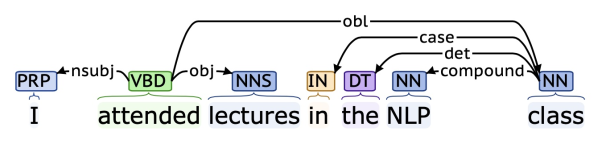
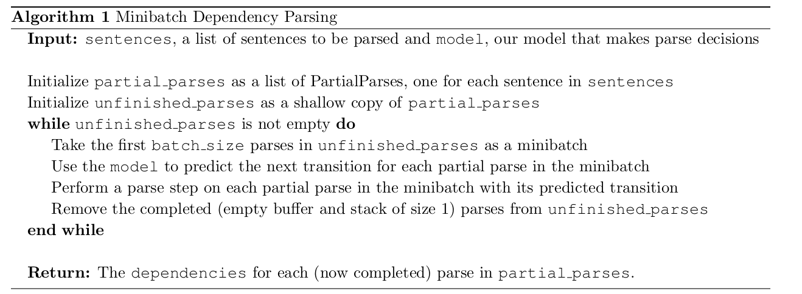

# Neural Transition-Based Dependency Parser

A dependency parser analyzes the grammatical structure of a sentence, establishing relationships between head words, and words which modify those heads. 



There are multiple types of dependency parsers, including transition-based parsers, graph-based parsers, and feature-based parsers. 
A transition-based parser, which incrementally builds up a parse one step at a time. At every step it maintains a partial parse, which is represented as follows:

1. A stack of words that are currently being processed.
2. A buffer of words yet to be processed.
3. A list of dependencies predicted by the parser.

Initially, the stack only contains ROOT, the dependencies list is empty, and the buffer contains all words of the sentence in order. At each step, the parser applies a transition to the partial parse until its buffer is empty and the stack size is 1. The following transitions can be applied:

1. **SHIFT**: removes the first word from the buffer and pushes it onto the stack.
2. **LEFT-ARC**: marks the second (second most recently added) item on the stack as a dependent of the first item and removes the second item from the stack, adding a first word → second word dependency to the dependency list.
3. **RIGHT-ARC**: marks the first (most recently added) item on the stack as a dependent of the second item and removes the first item from the stack, adding a second word → first word dependency to the dependency list.


In this project, a **Neural Transition-Based Dependency Parser** is implemented i.e. a neural network will predict which transition should be applied next to a partial parse

## Setup

The Code is written in Python 3.12.2 . If you don't have Python installed you can find it [here](https://www.python.org/downloads/). If you are using a lower version of Python you can upgrade using the pip package, ensuring you have the latest version of pip

```
conda env create -f local_env.yml
conda activate depedency_parser
```

## Dataset

For this experiment we used `Penn Treebank (annotated with Universal Dependencies)` dataset.

The dataset can be found with this repository under `data` folder

More details on the dataset can be found [here](https://paperswithcode.com/dataset/penn-treebank)

## Usage

1. Clone the repository

    `git clone https://github.com/shasha3493/Neural-Transition-Based-Dependency-Parser.git`
  
2. Change to the working directory

    `cd Neural-Transition-Based-Dependency-Parser`
    
3. To train the model 
    
    `python run.py`
    
## Algorithm



First, the model extracts a feature vector representing the current state. We will be using the feature set presented in the original neural dependency parsing paper: [A Fast and Accurate Dependency Parser using Neural Networks](https://nlp.stanford.edu/pubs/emnlp2014-depparser.pdf). This feature vector consists of a list of tokens (e.g., the last word in the stack, first word in the buffer, dependent of the second-to-last word in the stack if there
is one, etc.) and predicts one of the three transitions to be applied to the partial parsed sentence

## Results

We used UAS score as our evaluation metric. UAS refers to **Unlabeled Attachment Score**, which is computed as the ratio between number of correctly predicted dependencies and the number of total dependencies despite of the relations 

**UAS score on dev set: 88.62**

**UAS score on test set: 88.98**